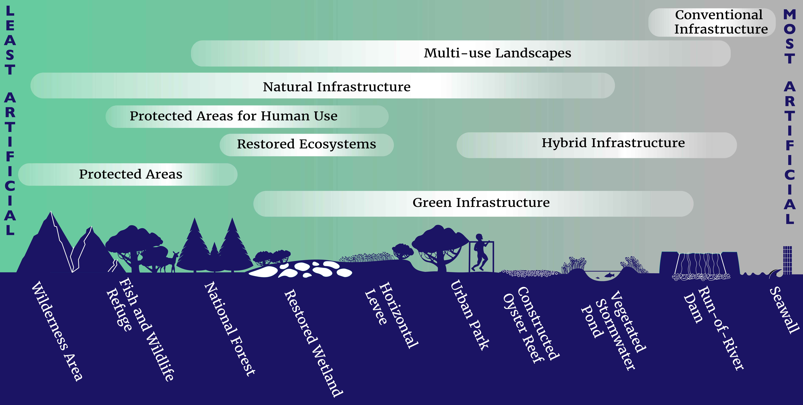

# **What is guidance on nature-based solutions?**
::: columns
::: {.column width="40%"}
What are nature-based solutions? Lots of formal definitions (e.g., [United Nations](https://www.naturebasedsolutionsinitiative.org/news/united-nations-environment-assembly-nature-based-solutions-definition/#:~:text=TheUNEA-5resolutionformally,effectivelyandadaptively%2Cwhilesimultaneously), [IUCN](https://inbs.iucn.org/))

What is guidance?

What is included on this site? Water resources.  

What's not included? Single papers. Only manuals.  

:::

::: {.column width="60%"}
```{r echo=FALSE, fig.cap="Nature-based solutions include a broad spectrum of activities (Van Rees et al., 2023 Proceedings of the National Academy of Sciences)."}

```
:::
:::

Add table showing different types of guidance.


# **High-level, overview resources**

Repositories and hubs of information:  

- [IUCN Nature-Based Solutions Homepage](https://inbs.iucn.org/)  
- [USACE's Engineering with Nature Initiative](https://ewn.erdc.dren.mil/)  
- [Network for Engineering with Nature](https://n-ewn.org/)  
- [Nature-based solutions for Urban Resilience in the Anthropocene (NATURA) Network](https://natura-net.org/)  
- [EcoShape](https://www.ecoshape.org/en/)  
- [Conservation International's Green-Gray Community of Practice](https://www.conservation.org/projects/global-green-gray-community-of-practice)  
- [PIANC's Working With Nature Initiative](https://www.pianc.org/working-with-nature/)  

Planning and project initiation manuals:

- [International Guidelines on Natural and Nature-Based Features for Flood Risk Management](https://ewn.erdc.dren.mil/international-guidelines-on-natural-and-nature-based-features-for-flood-risk-management/)  
- [Australian manual on flood mitigation](https://iceds.anu.edu.au/news-events/news/nature-based-solutions-flood-mitigation-australia-national-guidelines)


# **Alternative Analysis Resources**

What are these? What is missing (a lot)?

- Flood management  
- Bank Stabilization  
  - [German Federal Waterways materials](https://ufersicherung-baw-bfg.baw.de/index-en.html)  
  - [United Kingdom Estuary Edges Approach](https://www.estuaryedges.co.uk/)  
  - [U.S. Federal Interagency Stream Restoration Working Group (1997)](https://www3.uwsp.edu/cnr-ap/UWEXLakes/PublishingImages/resources/restoration-project/StreamRestorationHandbook.pdf)  
  - [US Department of Agriculture engineering manual for stream restoration](https://policy.nrcs.usda.gov/searchdirective/210%20H%20Part%20654)
  - [US Bureau of Reclamation (2015)](https://www.usbr.gov/tsc/techreferences/mands/mands-pdfs/A-BankStab-final6-25-2015.pdf)  
  - [US National Cooperative Highway Research Program (2005)](https://onlinepubs.trb.org/onlinepubs/nchrp/nchrp_rpt_544.pdf)  
  - [US Army Corps of Engineers (1997)](https://hdl.handle.net/11681/9983)  
  - [US National Large Wood Manual](https://ewn.erdc.dren.mil/publications/archive/national-large-wood-manual/)  
  - PIANC Committee on Technical-Biological bank stabilization  
    - [Part 1: Basics of a best practice approach](https://www.pianc.org/publication/technical-biological-bank-protections-for-inland-waterways-part-1-basics-of-a-best-practice-approach/)    
    - [Part 2: Library of measures](https://www.pianc.org/publication/technical-biological-bank-protections-for-inland-waterways-part-2-library-of-measures/)  
    - [Part 3: Decision support advice](https://www.pianc.org/publication/technical-biological-bank-protections-for-inland-waterways-part-3-decision-support-advice/)  
- River modification  
- Ports and harbors  
  - [Nature-Based Solutions for Ports: An Overview of NBS Implementation in Practice - Opportunities and Challenges](https://openknowledge.worldbank.org/entities/publication/f6e6b4cb-74c0-4bef-ab5c-da6cc0bdbebe)  
- Disaster management  


# **Performance-based Design of Features**

Insert preamble.  

- Floodplain benching  
- Oyster reefs  


# **Regional Design Resources**

Insert preamble.  

- [Sonoma County BMP Guide](https://permitsonoma.org/divisions/naturalresources/stormwaterandwaterqualityprograms/bestmanagementpractices/bestmanagementpracticeguide)  
- [Sonoma County Flood Management Design Manual](https://www.sonomawater.org/media/PDF/Water%20Resources/Flood%20Protection/Flood%20Management%20Design%20Manual/FMDM_Main_Body_Mar2020_ADA%20v2.pdf)  
- [Orange County Flood Control District Design Manual](https://ocip.ocpublicworks.com/sites/ocpwocip/files/2023-02/OCFCD%20DM%20-%202nd%20Ed_0.pdf)  
- [Upper Mississippi River restoration design manual](https://www.mvr.usace.army.mil/Portals/48/docs/Environmental/UMRR/HREP/EMP_Documents/2012%20UMRR%20EMP%20Environmental%20Design%20Handbook%20-%20FINAL.pdf)  


# **Case Studies Compilations**

Insert preamble.  

- [Engineering With Nature Atlas Series](https://ewn.erdc.dren.mil/atlas-series/)  
- [NATURA Global Roadmap for Urban Nature-based Solutions](https://www.nbsroadmap.org/)
- [Audubon Nature Works](https://media.audubon.org/2025-11/NatureWorks_final_20251106.pdf?_gl=1*kqm0c4*_gcl_au*MjA4NTg4MjQ4Ni4xNzcwMjEwMjA0*_ga*MTQ1MzQ3MTM2OC4xNzcwMjEwMjA1*_ga_X2XNL2MWTT*czE3NzAyMTAyMDQkbzEkZzAkdDE3NzAyMTAyMDQkajYwJGwwJGgw)  
- [Case study platform from the Nature Based Solutions Initiative](https://casestudies.naturebasedsolutionsinitiative.org/case-search/)  
- [Inter-American Development Bank examples from Latin America and the Caribbean](https://publications.iadb.org/en/nature-based-solutions-latin-america-and-caribbean-support-inter-american-development-bank) (Appendix A)  
- [City Adapt database for Latin America](https://cityadapt.com/en/nbs-implemented/)  
- [National River Restoration Science Synthesis](https://khondula.github.io/nrrss/)  
- [International Stormwater BMP Database](https://bmpdatabase.org/)

